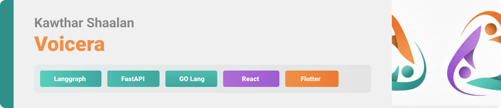

 

# Welcome to Voicera
### *Walking beside you, seeing with you, and listening to you.*

Voicera is more than just an application; it is a **digital companion** crafted with one singular mission: to restore independence and bring warmth to the lives of the visually impaired. We believe that technology should not just be functional—it should be **caring**.

 

<!-- project overview -->

### The Heart of Our Project
Voicera is built on the foundation of **Community Service** and **Empowerment**:
*   **Freedom of Sight**: We provide eyes through technology, allowing users to navigate their world with confidence.
*   **A Supportive Hand**: Designed specifically for the blind community to handle daily tasks independently.
*   **A Human Touch**: We moved away from cold, robotic responses to create an experience that feels like talking to a friend.
*   **Accessibility for All**: Our goal is to break down the barriers between the digital world and those who see it differently.

 

<!-- System Design -->

### System Design 
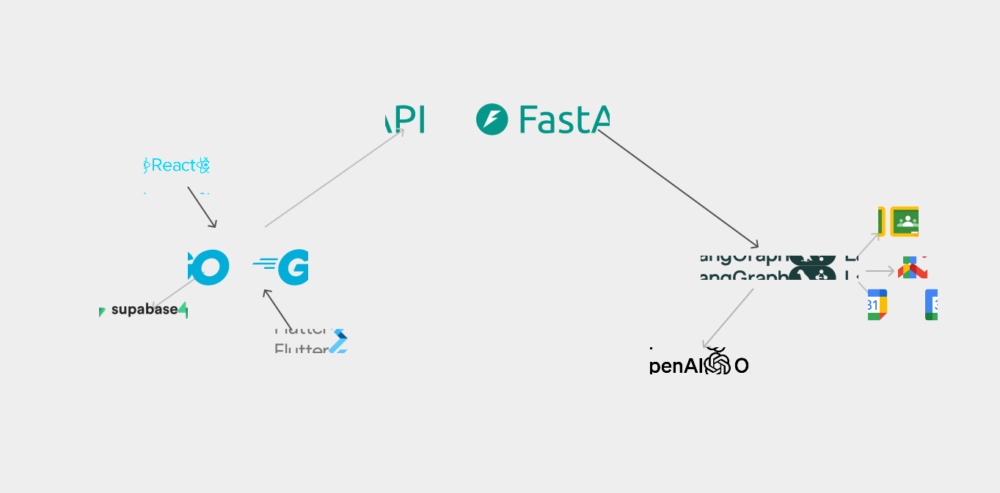

### Entity Relationship Diagram 
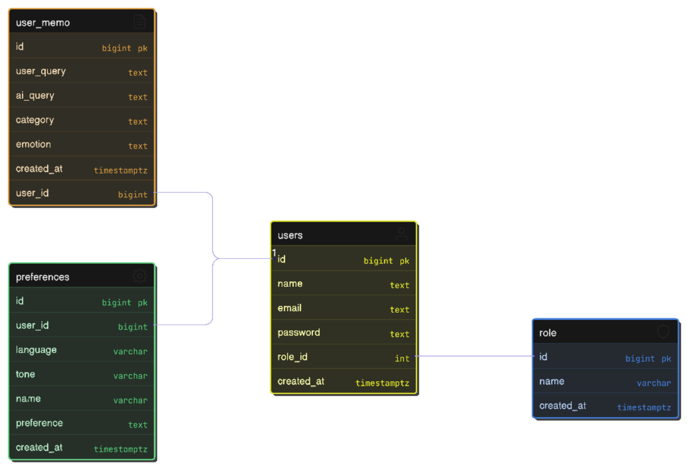

### Agentic System 

 

### The Agentic Brain (Our Workflow)
The magic of Voicera lies in its **Agentic Workflow**—a sophisticated multi-agent system that works in harmony to understand, think, and respond.

*   **The Wise Router**: Every word you say is first heard by our Navigator. It understands your intent and guides you to the right companion.
*   **Specialized Minds**:
    *   **Aria (The Companion)**: Your friendly, empathetic heart. She handles personal chats and lifestyle advice with warmth and care.
    *   **Orion (The Professional)**: Your dedicated worker. He helps with emails, schedules, and professional tasks with precision.
    *   **Eureka (The Mentor)**: Your nerdy academic guide. She assists with study plans, documents, and learning new things.
*   **A Shared Soul (Memory)**: All agents share a "Long-term Memory." They remember your name, your favorite coffee, and your past stories. You never have to explain yourself twice.
*   **Dynamic Intelligence**: Our system doesn't just follow a script; it reasons, plans, and acts to solve your problems in real-time.

 

<!-- Project Highlights -->

### Key Features Wrapped in Care

#### Voice First AI Assistant 
- Fully hands-free interaction, no typing required

#### Multi-Agent Architecture with Personas
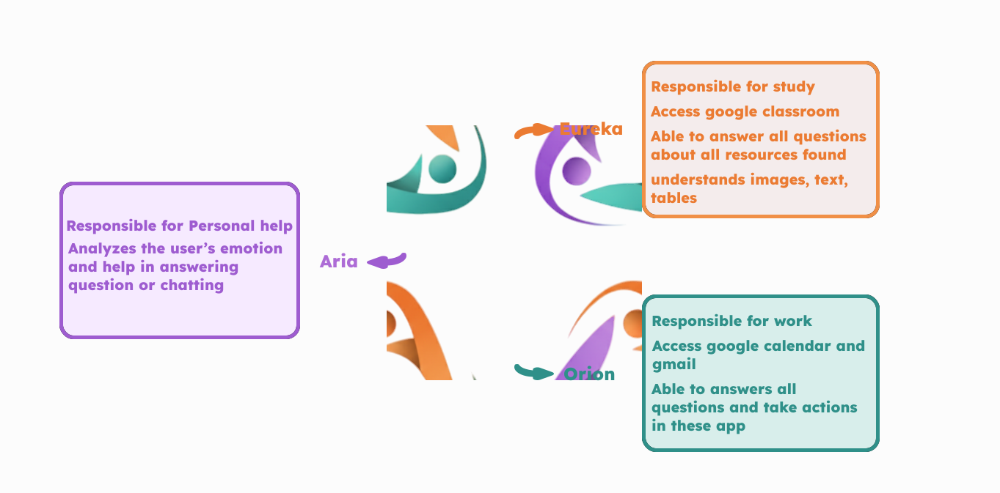

*   **Seeing Through Images (Image-to-Text)**:
    *   Simply upload or capture a photo.
    *   We describe the world in rich, vivid detail.
    *   From a loved one's smile to the label on a medicine bottle, we describe it all.
*   **A Voice That Listens (Text-to-Speech)**:
    *   We don't just display text; we speak it.
    *   Our voices are expressive, clear, and designed to be pleasant to the ear.
    *   A completely hands-free experience.
*   **Feeling Your Heart (Emotion Detection)**:
    *   We listen for the subtle tones in your voice and the meaning in your words.
    *   If you're happy, we celebrate with you.
    *   If you're down, we offer a soft, supportive shoulder.
*   **Total Companionship**:
    *   Every interaction is infused with a "Caring Layer."
    *   We prioritize your well-being in every response.

 

### Explore the Experience

#### User Screens (Mobile)

| Landing | Login | Register |
| --------------------------------------- | ------------------------------------- | ------------------------------------- |
| 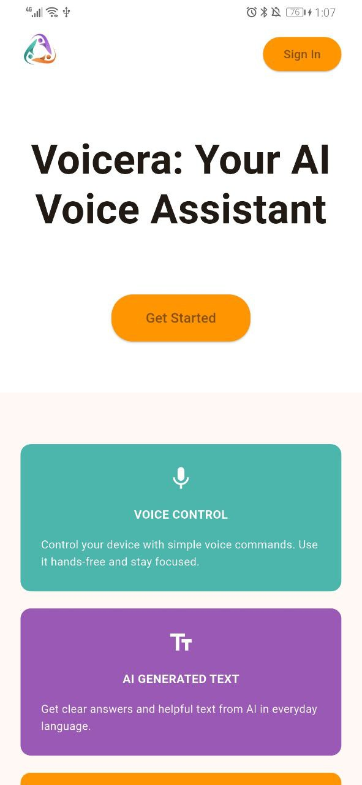 | 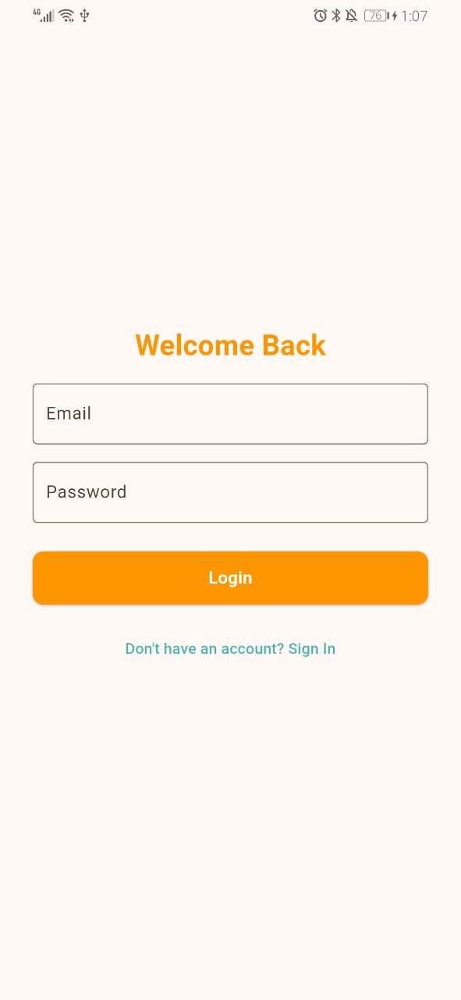 | 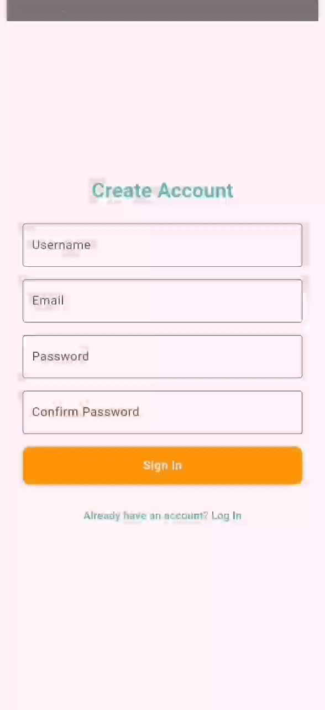 |

| Prefrences | Chat | Notification |
| --------------------------------------- | ------------------------------------- | ------------------------------------- |
|  | 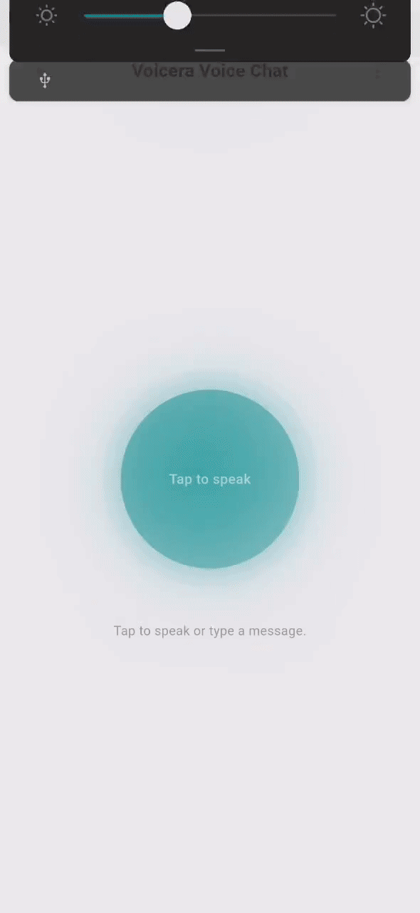 | 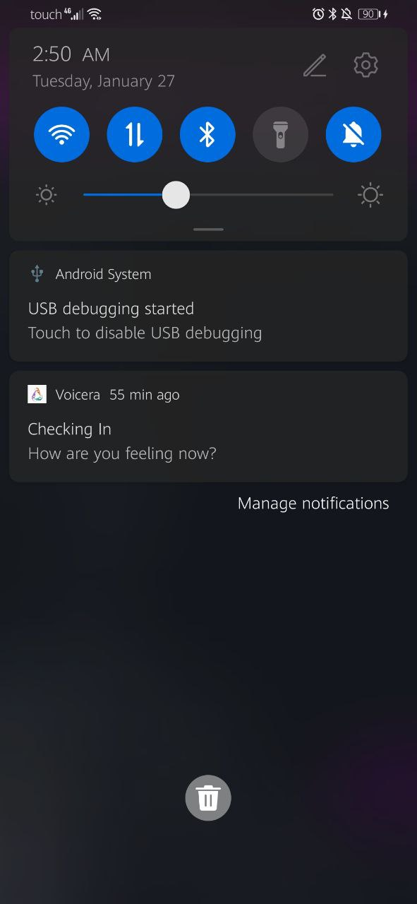 |

#### Admin Screens (Web)
| Chat screen                             | Write Chat screen                       |
| --------------------------------------- | ------------------------------------- |
| 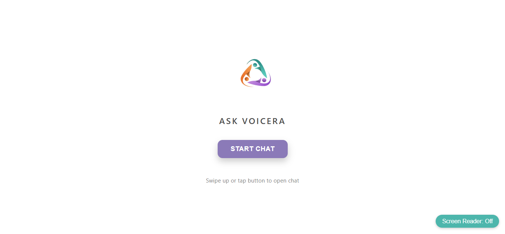 | 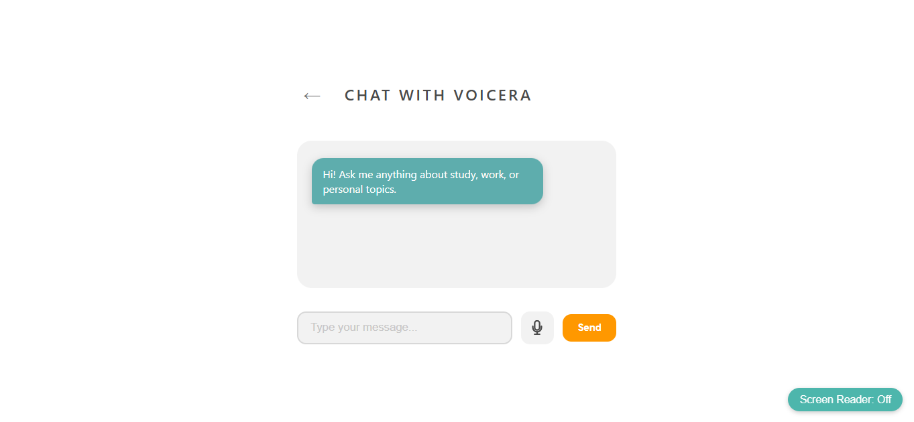 |

 

<!-- Development & Testing -->

### Built with Integrity

| Services                            | CI/CD                       | Testing GO                      | Testing Agents                      | 
| --------------------------------------- | ------------------------------------- | ------------------------------------- | ------------------------------------- |
| 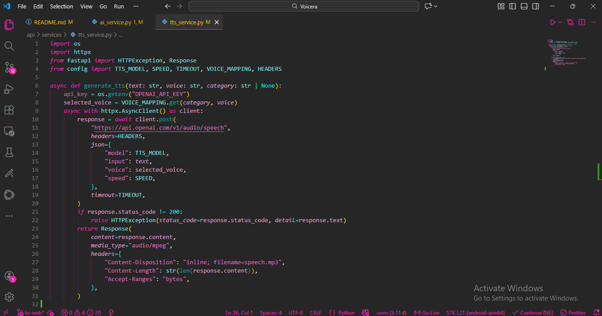 | 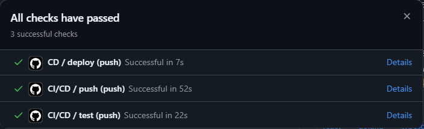 | 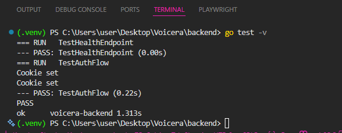 | 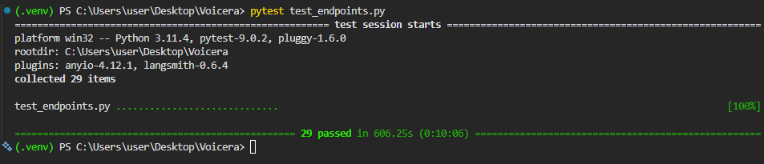 |

 

### Deployment & Health

- Voicera is designed for high availability to ensure we are always there when you need us.

| Postman API Health                          | Postman API Register                       | Postman API User                       |
| --------------------------------------- | ------------------------------------- | ------------------------------------- |
| 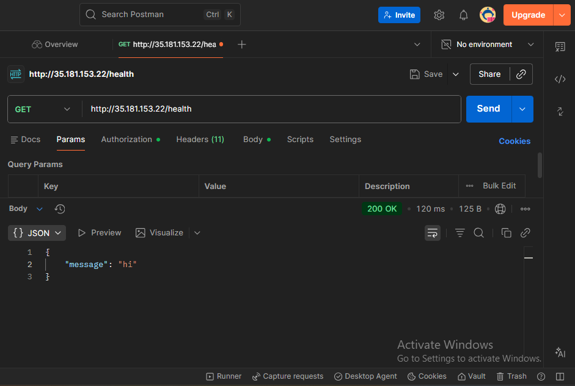 |  | 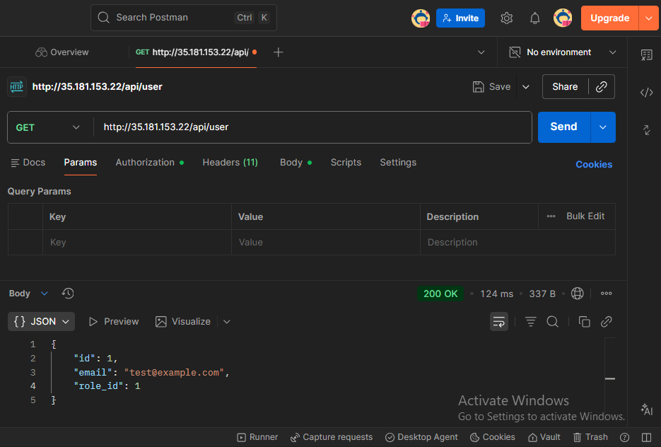 |

 

## License

This project is licensed under the MIT License - see the [LICENSE](LICENSE) file for details.
