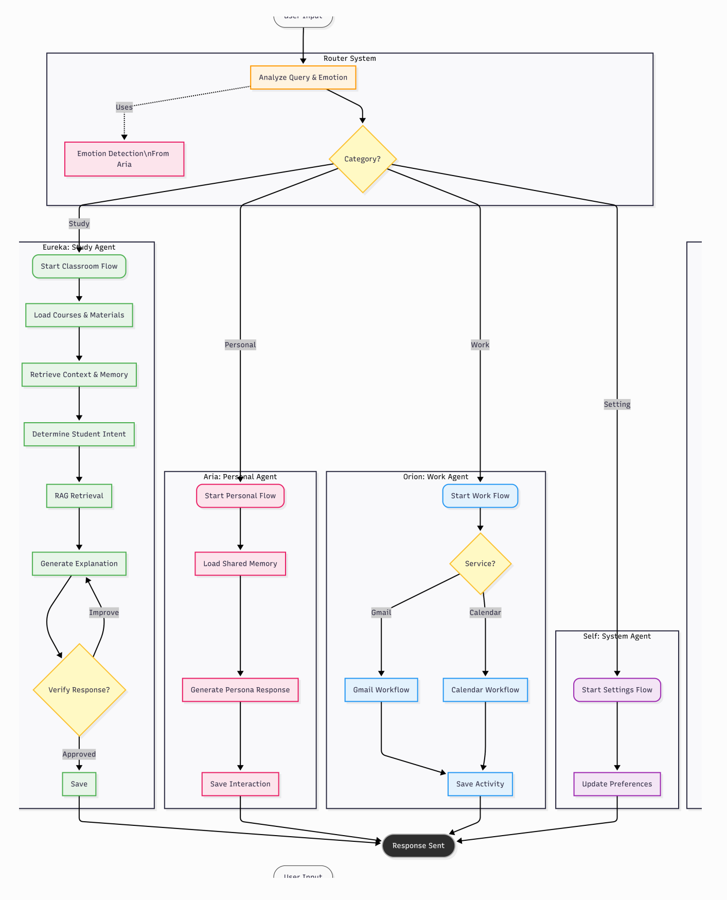
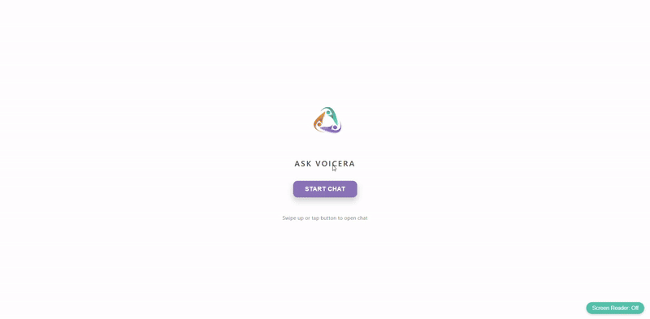
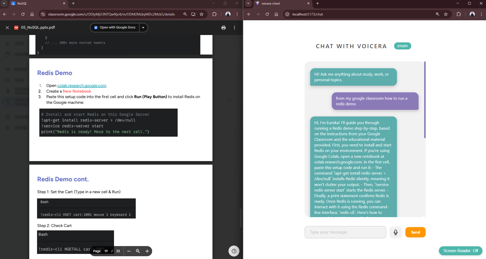

 

# Welcome to Voicera
### *Walking beside you, seeing with you, and listening to you.*

Voicera is more than just an application; it is a **digital companion** crafted with one singular mission: to restore independence and bring warmth to the lives of the visually impaired. Technology should not just be functional it should be **caring**.

 

<!-- project overview -->

### The Heart of Voicera
Built on the foundation of **Community Service** and **Empowerment**:
*   **Freedom of Sight**: Providing eyes through technology, allowing users to navigate their world with confidence.
*   **A Supportive Hand**: Designed specifically for the blind community to handle daily tasks independently.
*   **A Human Touch**: Interaction that moves away from cold, robotic responses to create experiences that feel like talking to a friend.
*   **Accessibility for All**: Breaking down the barriers between the digital world and those who see it differently.

 

<!-- System Design -->

### System Design 

### Entity Relationship Diagram 

### Agentic System 

 

### The Agentic Brain (The Workflow)
Voicera is powered by an **Agentic Workflow**, a sophisticated multi-agent system that collaborates to analyze, reason, and deliver precise responses.

*   **The Intent Router**: Every spoken input is processed by a central Navigator that identifies user intent and directs the interaction to the optimal specialized agent.
*   **Specialized Minds**:
    *   **Aria (The Companion)**: A friendly, empathetic heart. She handles personal chats and lifestyle advice with warmth and care.
    *   **Orion (The Professional)**: A dedicated worker. He helps with emails, schedules, and professional tasks with precision.
    *   **Eureka (The Mentor)**: A nerdy academic guide. She assists with study plans, documents, and learning new things.
*   **A Shared Soul (Memory)**: All agents share a "Long-term Memory." They remember names, favorite coffee, and past stories. Users never have to explain themselves twice.
*   **Dynamic Intelligence**: This system doesn't just follow a script; it reasons, plans, and acts to solve problems in real-time.

 

<!-- Project Highlights -->

### Key Features Wrapped in Care

#### Voice First AI Assistant 
- Fully hands-free interaction, no typing required

#### Multi-Agent Architecture with Personas

*   **Seeing Through Images (Image-to-Text)**:
    *   Simply upload or capture a photo.
    *   The world is described in rich, vivid detail.
*   **A Voice That Listens (Text-to-Speech)**:
    *   The application doesn't just display text; it speaks it.
    *   Voices are expressive, clear, and designed to be pleasant to the ear.
    *   A completely hands-free experience.
*   **Feeling Your Heart (Emotion Detection)**:
    *   Voicera finds meaning in words.
    *   Happiness is celebrated together.
    *   Soft, supportive shoulders are offered when a user is down.
*   **Total Companionship**:
    *   Every interaction is infused with a "Caring Layer."
    *   Well-being is prioritized in every response.

 

### Explore the Experience

#### User Screens (Mobile)

| Landing | Login | Register |
| --------------------------------------- | ------------------------------------- | ------------------------------------- |
|  |  |  |

| Chat | Notification | Image to Speech |
| --------------------------------------- | ------------------------------------- | ------------------------------------- |
|  |  |  |

#### Admin Screens (Web)
| Chat screen                             | Write Chat screen                       |
| --------------------------------------- | ------------------------------------- |
|  |  |

| Image to text                              | PDF Rag Chat                        |
| --------------------------------------- | ------------------------------------- |
|  |  |

  

| Services                            | CI/CD                       | Testing GO                      | Testing Agents                      | 
| --------------------------------------- | ------------------------------------- | ------------------------------------- | ------------------------------------- |
|  |  |  |  |

  

### Deployment 

- Voicera is designed for high availability to ensure it is always there when needed.

| Postman API Health                          | Postman API Register                       | Postman API User                       |
| --------------------------------------- | ------------------------------------- | ------------------------------------- |
|  |  |  |

 

## License

This project is licensed under the MIT License - see the [LICENSE](LICENSE) file for details.
