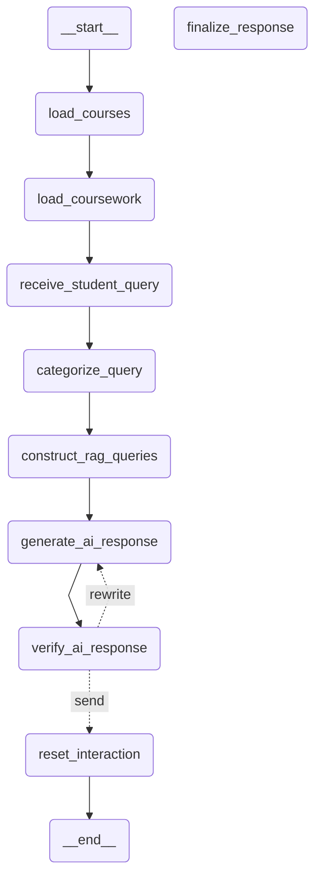

# Agent Graph Workflow

```mermaid
---
config:
  flowchart:
    curve: linear
---
graph TD;
	__start__(<p>__start__</p>)
	load_courses(load_courses)
	load_coursework(load_coursework)
	receive_student_query(receive_student_query)
	categorize_query(categorize_query)
	construct_rag_queries(construct_rag_queries)
	generate_ai_response(generate_ai_response)
	verify_ai_response(verify_ai_response)
	finalize_response(finalize_response)
	reset_interaction(reset_interaction)
	__end__(<p>__end__</p>)
	__start__ --> load_courses;
	categorize_query --> construct_rag_queries;
	construct_rag_queries --> generate_ai_response;
	generate_ai_response --> verify_ai_response;
	load_courses --> load_coursework;
	load_coursework --> receive_student_query;
	receive_student_query --> categorize_query;
	verify_ai_response -. &nbsp;rewrite&nbsp; .-> generate_ai_response;
	verify_ai_response -. &nbsp;send&nbsp; .-> reset_interaction;
	reset_interaction --> __end__;
	classDef default fill:#f2f0ff,line-height:1.2
	classDef first fill-opacity:0
	classDef last fill:#bfb6fc

```
